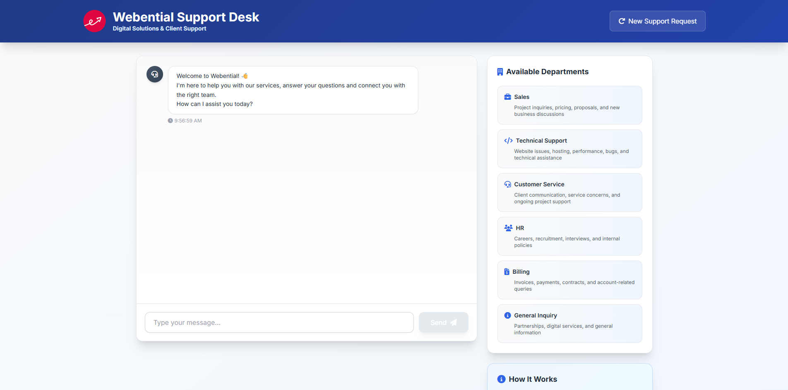
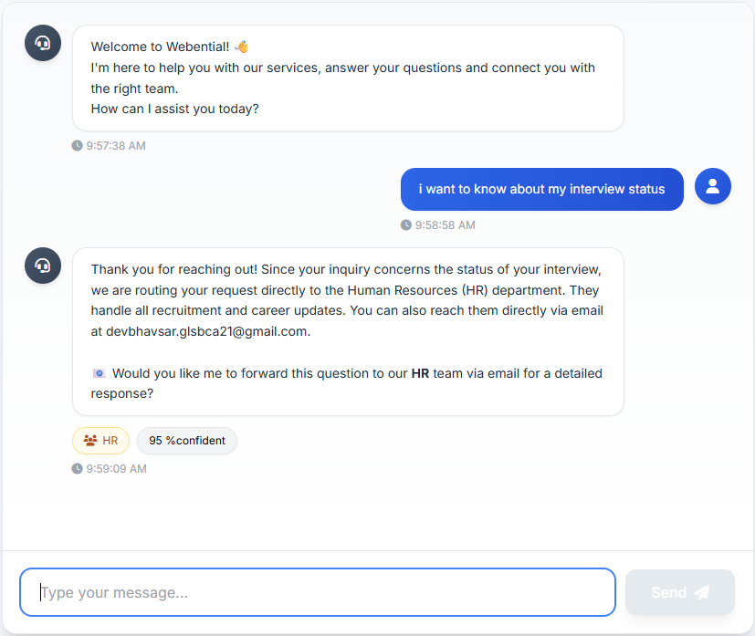
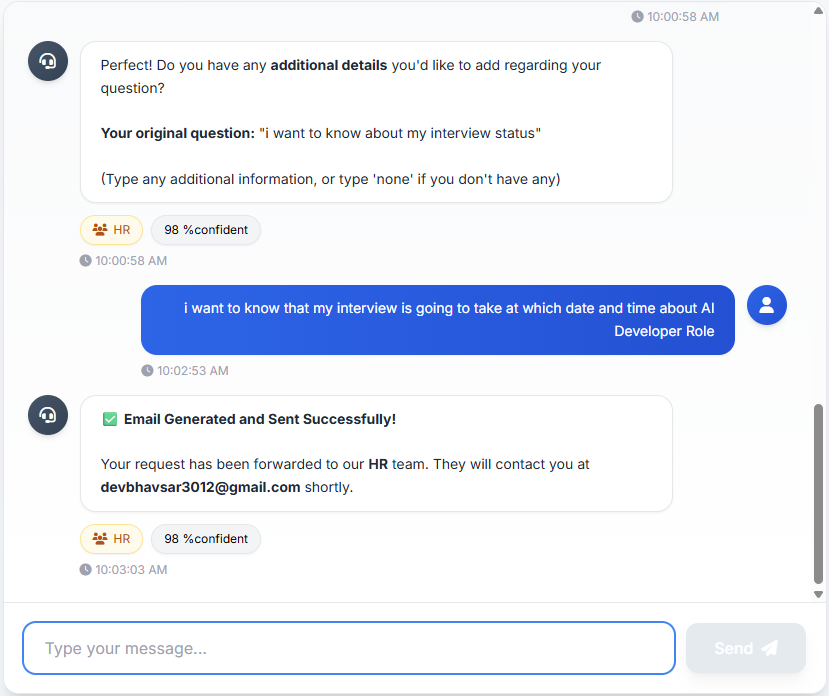
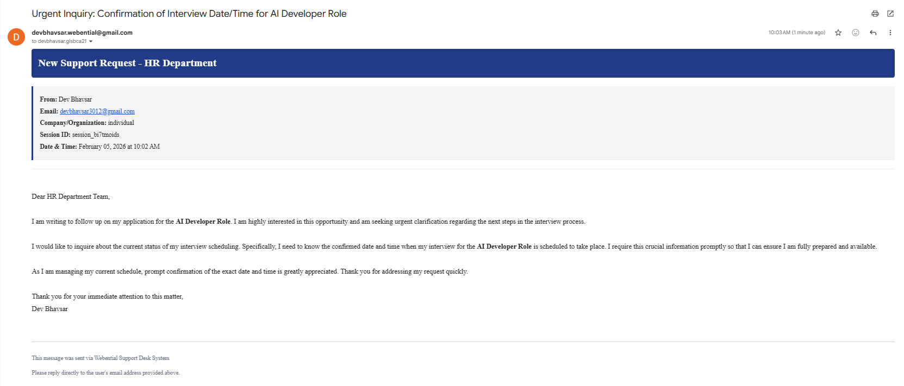

# 🤖 Enhanced Department Router Chatbot

**An intelligent, context-aware chatbot that automatically routes customer inquiries to the right department using AI-powered semantic analysis and vector similarity search.**

[Demo](#-demo)

---

## 📋 Table of Contents

- [Overview](#-overview)
- [Demo](#-demo)
  
---

## 🌟 Overview

The **Enhanced Department Router Chatbot** is a sophisticated AI-powered customer support system designed to intelligently route user inquiries to appropriate departments within an organization. Built with Google's Gemini AI and ChromaDB vector database, it provides context-aware responses, maintains conversation history, and streamlines the support workflow through automated email routing.

### 🎯 Perfect For:
- **Digital agencies** managing multiple service departments
- **SaaS companies** with complex support structures
- **E-commerce platforms** handling diverse customer inquiries
- **Any organization** looking to automate initial customer support triage

---

## 🎥 Demo

### 🖼️ Step 1 – Chatbot Dashboard & Departments

Shows the main support desk interface where users can chat with the AI and view all available departments for intelligent query routing.

---

### 🖼️ Step 2 – AI Intent Detection & Routing

Demonstrates how the chatbot understands the user’s query and automatically routes it to the correct department with a confidence score.

---

### 🖼️ Step 3 – Context Collection & Confirmation

Highlights the chatbot asking for additional details to generate a more accurate and professional support request.

---

### 🖼️ Step 4 – Automated Email Generation

Displays the final email automatically generated and sent to the relevant department, confirming end-to-end automation.

---

### ⭐ If you find this project useful, please consider giving it a star! ⭐

**Made with ❤️ by AI Developers for AI Developers**

[⬆ Back to Top](#-enhanced-department-router-chatbot)

